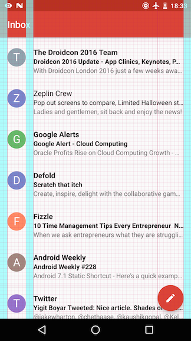
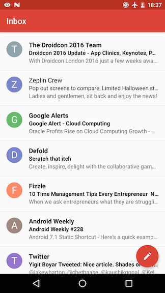

# Keylines
Painlessly build and ship apps that conform to the [Material design specifications](https://material.google.com/layout/metrics-keylines.html#metrics-keylines-baseline-grids).

 

## The Tool
The tool is split into two,

1. **Keylines** - Install this Android app first. It is responsible for rendering and controlling design specifications on the screen.
2. **SDK** - Integrated into the app. It communicates with the **Keylines** app to render defined specifications.

## SDK Quick Start

**1. In your root** **`build.gradle`**,
```gradle
allprojects {
    repositories {
        maven { url "https://jitpack.io" }
    }
}
```

**2. In the** **`build.gradle`** **of your module,**
```gradle
 dependencies {
   debugCompile   'com.github.ragunathjawahar.keylines:sdk:0.1-alpha'
   releaseCompile 'com.github.ragunathjawahar.keylines:sdk-no-op:0.1-alpha'
   testCompile    'com.github.ragunathjawahar.keylines:sdk-no-op:0.1-alpha'
 }
```

**3. Write a design specification.**

The spec files go into the **`res/raw`** folder. For instance, **`res/raw/activity_emails.spec`**
```json
{
  "keylines": [
    { "offset": 16, "from": "LEFT" },
    { "offset": 72, "from": "LEFT" },
    { "offset": 16, "from": "RIGHT" },
    { "offset": 16, "from": "BOTTOM" }
  ],

  "spacings": [
    { "offset": 0, "size": 16, "from": "LEFT" },
    { "offset": 56, "size": 16, "from": "LEFT" },
    { "offset": 0, "size": 16, "from": "RIGHT" }
  ]
}
```

The tool is based on Lucas Rocha's [DSpec](https://github.com/lucasr/dspec) library. All units are in DPs. If you want to use a different cell size for the baseline grid, add a `baselineGridCellSize` attribute to your spec. For now, [this](https://github.com/ragunathjawahar/keylines/blob/master/app/src/main/java/org/lucasr/dspec/SpecParser.java#L45-L56) should give an idea about the other keywords that can go into the specification.

**4. In your Activity,**
````java
@DesignSpec(R.raw.activity_emails)
public class EmailsActivity extends AppCompatActivity {
    // ...
}
````
Just add the `@DesignSpec` annotation to your `Activity` classes.

**5. In your Fragment,**
````java
@DesignSpec(R.raw.fragment_email_detail)
public class EmailDetailFragment extends Fragment {
    // ...

    @Override
    public void onStart() {
        super.onStart();
        Keylines.getInstance().spec(this); // Consider moving this to a base Fragment class.
    }
}
````

That's all. You are all set to build and ship awesome apps conforming to the Material design specifications.

### License


    Copyright 2014 Lucas Rocha
    Modifications 2016 Ragunath Jawahar

    Licensed under the Apache License, Version 2.0 (the "License");
    you may not use this file except in compliance with the License.
    You may obtain a copy of the License at

       http://www.apache.org/licenses/LICENSE-2.0

    Unless required by applicable law or agreed to in writing, software
    distributed under the License is distributed on an "AS IS" BASIS,
    WITHOUT WARRANTIES OR CONDITIONS OF ANY KIND, either express or implied.
    See the License for the specific language governing permissions and
    limitations under the License.
